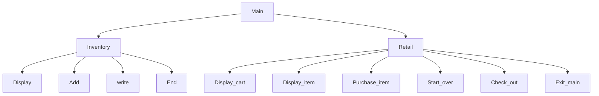

# chapter-10-team-project
Liam Dowell, Braxton Hartley

## <chapter-10-team-project> Shop
A shop where you controll sales and inventory

### <program_name> Flowchart

#### Function Diagrams

| `Menu`    |               |  Liam Dowell    |
| ------------------ | ------------- | ------------ |
| Accepts no arguements    | It calls retail and inventory |              |

***
| `inventory`    |               |     Liam Dowell  |
| ------------------ | ------------- | ------------ |
| accepts no arguements | runs the display, add, write, and end inventory  |   pushes inventory to a dat file           |

***

| `Retail`    |               |     Braxton Hartley   |
| ------------------ | ------------- | ------------ |
|  No arguments   | it will display what is in cart, what is being sold, let you purchase, restart, check out  |    It lets you shop and edits the inventory          |
***

